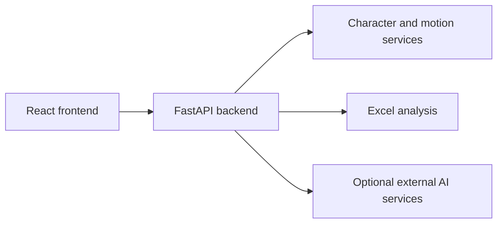

# TaskPet

TaskPet is a local-first AI desktop-pet workspace that combines character creation, pet interaction, Excel analysis, optional AI business insights, dashboards, and local task history.

## Features

- Photo-based character setup with browser-side person detection
- Character generation, transparent normalization, and Character Library
- Pet states for idle, walking, chatting, thinking, working, waiting, and celebrating
- Generated state assets and walking-motion packs with graceful fallback
- Resizable chat panel, theme switching, and font scaling
- Workspace file list with `.xlsx` upload and repeatable drag-to-pet analysis
- Deterministic Excel metrics, data-quality checks, regional/product rankings, and trends
- Optional OpenAI-compatible business insights with evidence validation
- Result dashboard plus recent-task and history restoration in browser storage

## Screenshots

Screenshots are intentionally omitted from the initial public release because the development environment contained private character assets.

## Architecture



The React frontend owns the user interface and browser-local state. FastAPI handles local file storage, deterministic Excel analysis, character assets, walking motion, and optional provider integrations. See [Architecture](docs/architecture.md) for details.

## Tech Stack

- Frontend: React 18, TypeScript 5.6, Vite 6, Lucide React
- Browser vision: MediaPipe Tasks Vision with a separately downloaded EfficientDet-Lite0 model
- Backend: Python, FastAPI, Uvicorn, Pydantic, HTTPX
- Image/video: Pillow, rembg, ONNX Runtime, NumPy, SciPy, imageio-ffmpeg
- Excel: pandas, openpyxl, python-multipart
- Tests: pytest and pytest-asyncio

Versions are pinned by `package-lock.json` and `server/requirements.txt`. See [Third-Party Notices](THIRD_PARTY_NOTICES.md) for licensing information.

`npm ci` copies MediaPipe's browser WASM runtime from the locked npm package into the ignored `public/mediapipe/` directory. Those generated vendor files are not stored in the source release archive.

## Download Vision Model

Before the first frontend run, download the pinned EfficientDet-Lite0 int8 model from Google MediaPipe's official model storage:

```bash
python scripts/download_models.py
```

The script writes the model to `public/models/efficientdet_lite0.tflite`, validates its pinned SHA-256 and TFLite header, and reports a non-zero exit code without leaving a partial model if the download fails. The model binary is ignored by Git and is not included in this repository.

EfficientDet-Lite0 is an external model distributed by its original provider and is not covered by TaskPet's MIT License. It is sourced from [Google MediaPipe / TensorFlow EfficientDet-Lite0](https://storage.googleapis.com/mediapipe-models/object_detector/efficientdet_lite0/int8/1/efficientdet_lite0.tflite) and is distributed upstream under Apache-2.0 terms. See [Third-Party Notices](THIRD_PARTY_NOTICES.md).

## Quick Start

Prerequisites: Node.js 20+, npm, and Python 3.9. The current Python dependency set is tested with Python 3.9.

### Backend

From the repository root:

```bash
cd server
python3.9 -m venv .venv
source .venv/bin/activate
python -m pip install --upgrade pip
python -m pip install -r requirements.txt
cp .env.example .env
# Edit .env only if you want to use external AI services.
uvicorn main:app --host 127.0.0.1 --port 8001
```

Open `http://127.0.0.1:8001/health`. With no API keys, the service still starts and reports credential/configuration flags without making an external request.

### Frontend

In a second terminal, from the repository root:

```bash
npm ci
npm run dev
```

Vite normally opens at `http://localhost:5173`. To verify a production build:

```bash
npm run build
```

## Environment Variables

Copy `.env.example` only when overriding the frontend backend URL. Copy `server/.env.example` to `server/.env` for backend settings.

| Variable | Purpose | Required |
| --- | --- | --- |
| `VITE_API_BASE_URL` | Frontend URL for the FastAPI service | No |
| `ARK_API_KEY` | Server-side credential for character/video generation | Only for provider generation |
| `ARK_API_STYLE` | Provider contract: `official`, `relay`, or `auto` | No |
| `ARK_IMAGE_MODEL` | Image model or endpoint ID | Only for character generation |
| `ARK_BASE_URL` | Image/video provider API base | Only for provider generation |
| `ARK_REQUEST_TIMEOUT_SECONDS` | Image request timeout | No |
| `ARK_VIDEO_MODEL` | Walking-video model or endpoint ID | Only for walking-video generation |
| `DEEPSEEK_API_BASE` | OpenAI-compatible chat-completions base URL | Only for AI insights |
| `DEEPSEEK_API_KEY` | Server-side insight-provider credential | Only for AI insights |
| `DEEPSEEK_MODEL_PRIMARY` | Primary insight model | Only for AI insights |
| `DEEPSEEK_MODEL_FALLBACK` | Fallback insight model | No |
| `DEEPSEEK_TIMEOUT_SECONDS` | Insight request timeout | No |
| `ALLOW_ORIGIN` | Comma-separated development CORS origins | No |
| `PORT` | Documented backend port | No |
| `UPLOAD_DIR` | Local `.xlsx` runtime directory | No |
| `MAX_UPLOAD_BYTES` | Upload size limit | No |
| `REMBG_MODEL` | rembg model name | No |
| `ASSET_CANVAS_SIZE` | Normalized character canvas size | No |
| `ASSET_BASE_URL` | Public URL prefix for local generated assets | No |
| `ASSET_OUTPUT_DIR` | Optional generated-character directory override | No |
| `ASSET_DOWNLOAD_TIMEOUT_SECONDS` | Remote asset download timeout | No |

Never expose backend keys through `VITE_` variables or commit a populated `.env` file.

## Generate Demo Data

After installing backend requirements, generate an entirely synthetic workbook:

```bash
python server/scripts/generate_demo_excel.py --output taskpet_demo_sales.xlsx
```

The workbook contains `销售日期`, `区域`, `产品名称`, `销售额`, `销量`, `订单编号`, and `渠道`. These fields are compatible with the current A1 parser. The output is deterministic, contains no user data, and is ignored by Git.

## Usage

1. Start the backend and frontend.
2. Create a character from your own permitted image and enter the Workspace.
3. Generate the demo workbook or select another supported `.xlsx` file.
4. Upload or drag the workbook to the pet, confirm the task plan, and run analysis.
5. Review deterministic metrics, optional AI insights, the Result Dashboard, and local History.

External provider credentials are unnecessary for the health check and deterministic Excel analysis. Character generation, walking-video generation, and AI narrative insights require compatible provider configuration.

## Privacy and Local Data

This repository does not include real user photos, generated character assets, character videos, user spreadsheets, API credentials, runtime data, or raw provider responses.

TaskPet is a local single-user prototype. Character Library metadata, Workspace file metadata, task history, and interface state primarily use browser `localStorage` and `sessionStorage`; uploaded workbooks and generated media use local FastAPI runtime directories. There is no account-level cloud synchronization or production privacy service. Clear browser site data and local runtime directories when you no longer need them.

## External Services and Trademarks

MediaPipe, DeepSeek-compatible endpoints, Seedream-compatible image generation, and Seedance-compatible video generation are referenced only as technologies or compatibility targets. No affiliation or commercial relationship is claimed.

External AI services, models, APIs, and their outputs are not included in the MIT license for this repository and remain subject to their respective providers' terms, pricing, acceptable-use rules, and output policies.

DeepSeek, Seedream, and other external AI services are not included in TaskPet's MIT License and are subject to their respective providers' terms. Users must provide their own API credentials.

## License

TaskPet source code is available under the [MIT License](LICENSE).

Copyright (c) 2026 ZHUO
