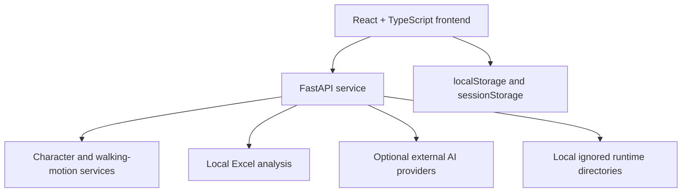

# Architecture

TaskPet is a local-first React application backed by a FastAPI service.

The frontend implements login, character setup, the workspace, file handling, task state, results, history, theme, and font controls. Browser storage retains local UI state and character-library metadata.

The FastAPI app exposes health, upload, Excel analysis, business-insight, character-generation, state-asset, and walking-motion endpoints. Uploaded spreadsheets, generated media, and metadata are written only to ignored local runtime directories. No database, account service, cloud synchronization, production authentication, queue, or deployment layer is included.

Provider calls are optional and configured only through backend environment variables. The health endpoint remains available without provider credentials and reports whether image and insight providers are configured.
